# HomeCare Pro - Home Healthcare Management System

A full-stack, responsive, and animated **Home Healthcare Management System** built with **HTML5, CSS3, Modern Vanilla JavaScript (ES6+), Python (Flask), and SQLite3**, modeled strictly on the 9-step home healthcare lifecycle workflow.

---

## 📋 9-Step Workflow Lifecycle

```mermaid
flowchart LR
    Start([START]) --> S1[1. Patient Registration & Login]
    S1 --> S2[2. Select Service]
    S2 --> S3[3. Book Appointment / Submit Request & Docs]
    S3 --> S4[4. Admin Assigns Healthcare Professional]
    S4 --> S5[5. Home Visit & Service Provided]
    S5 --> S6[6. Update Records & Upload Reports/Rx]
    S6 --> S7[7. Payment: Online / Cash]
    S7 --> S8[8. View Records, Reports & History]
    S8 --> S9[9. Feedback & Rating]
    S9 --> Dec{Satisfied?}
    Dec -- Yes --> End([END - Service Complete])
    Dec -- No --> Issue[Issue Resolution Ticket & Refund] --> End
```



---

## 🌟 Key Features

1. **Step 1: Patient Registration & Multi-Role Authentication**
   - Patients, Healthcare Providers (Nurses, Doctors, Therapists, Phlebotomists), and System Administrators.
   - Quick **One-Click Demo Switcher Bar** on top for instant testing across all roles.

2. **Step 2: Healthcare Service Catalog**
   - Skilled Nursing Care, Elderly & Assisted Living, Physical & Rehab Therapy, Home Lab Diagnostics, Doctor Home Consultation, and Postnatal Mother & Newborn Care.
   - Filter by category, view transparent inclusions, durations, and pricing.

3. **Step 3: Appointment Booking & Document Upload**
   - Multi-step interactive booking modal.
   - Date & time slot selector.
   - Auto-detect GPS location or manual address entry.
   - Chief medical symptoms description and emergency contact.
   - **Document Drag & Drop Upload**: Upload past medical prescriptions, discharge summaries, or doctor slips with preview.

4. **Step 4: Admin Assignment & Dispatch Hub**
   - Live appointments dispatch board with status filters (`Pending`, `Assigned`, `In-Progress`, `Completed`, `Issue Raised`).
   - Match verified clinicians based on specialization, verified star rating, and experience.

5. **Step 5: Home Visit & Service Management**
   - Healthcare professional itinerary console.
   - Destination address with navigation route simulation.
   - **Check-in / Start Visit** button with live visit timer.

6. **Step 6: Bedside Vitals, Clinical Notes & Digital Prescription Builder**
   - Log clinical vitals: Blood Pressure, Pulse (bpm), Temp (°F), SpO2 (%), Blood Sugar (mg/dL), Respiration (bpm).
   - Clinical observations and treatment notes.
   - **Interactive Digital Prescription Builder**: Add/remove medicine rows with dosage, timing (before/after food), frequency, and duration.
   - Diagnostic lab report uploader.

7. **Step 7: Payment Checkout (Online & Cash)**
   - Itemized transparent invoice breakdown (Base fee + Consumables + Tax).
   - **Credit / Debit Card Simulator** with live 3D card preview.
   - **UPI & QR Code Scanner** with timer simulation.
   - **Cash on Delivery (Cash on Visit)** option with instant digital receipt.

8. **Step 8: Health Records Vault, Vitals Chart & Printouts**
   - Interactive Canvas chart visualizing patient Vitals health trends over time.
   - Historical appointment timeline.
   - **Print-ready & Downloadable Digital Prescription** with clinic header, Rx badge, and doctor seal.
   - **Print-ready & Downloadable Tax Invoice & Receipt**.

9. **Step 9: Feedback, Rating & Issue Resolution Gateway**
   - 5-star interactive animated rating with highlight tags.
   - Written experience review.
   - **Service-Satisfaction Decision Choice**:
     - *Yes, Satisfied*: Marks appointment complete with thank-you card.
     - *No, Issue Faced*: Opens **Issue Resolution Center** to select category (*Delayed Arrival, Quality, Billing, Demeanor*), desired remedy (*Refund, Replacement Visit, Escalation*), and generates support tickets directly synced to Admin dashboard.

---

## 🚀 Quick Start & Installation

### Prerequisites
- Python 3.10+ (Installed at `%LOCALAPPDATA%\Programs\Python\Python312` or in PATH)
- Flask (`pip install flask`)

### Run Application
1. Double-click `run.bat` or open PowerShell:
```powershell
python app.py
```
2. Open your web browser to:
```
http://127.0.0.1:5000
```

---

## 🔑 Demo Login Accounts

| Role | Name | Email | Password |
|---|---|---|---|
| **Patient** | John Doe | `patient@demo.com` | `demo123` |
| **Admin** | Dr. Arthur Vance | `admin@demo.com` | `admin123` |
| **Nurse** | Sarah Jenkins, RN | `nurse.sarah@demo.com` | `nurse123` |
| **Doctor** | Dr. James Wilson, MD | `dr.james@demo.com` | `doctor123` |
| **Therapist** | Elena Rostova, MPT | `pt.elena@demo.com` | `therapist123` |

*(Tip: You can also use the top **Demo Quick Role Switcher** to switch roles with a single click!)*

---

## 🧪 Running Automated Tests
```powershell
python -m unittest discover -s tests -p "test_*.py" -v
```
